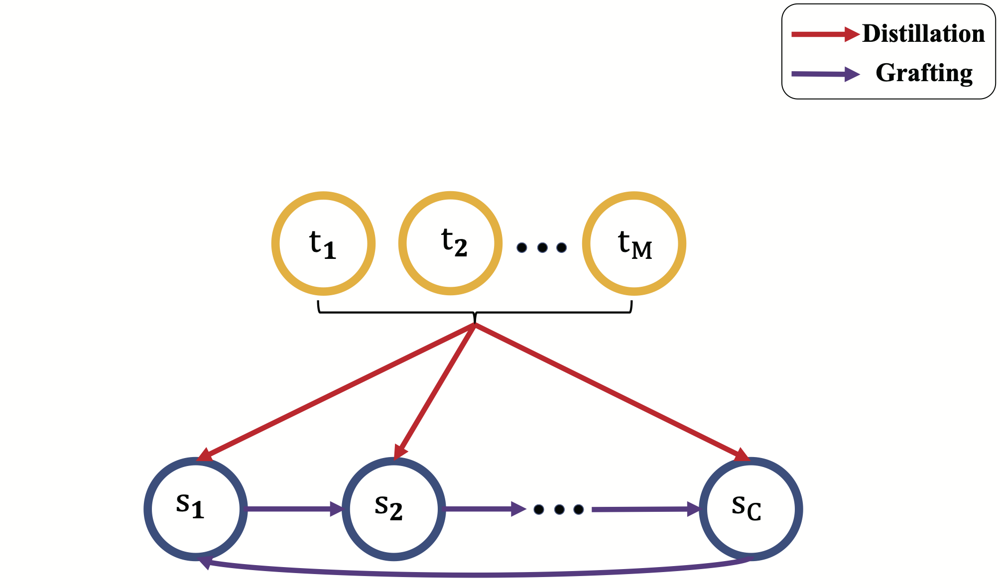

# Filter Grafting for Deep Neural Networks
## Introduction

This is the PyTorch implementation of our paper "[Filter Grafting for Deep Neural Networks:Reason, Method, and Cultivation](https://arxiv.org/abs/2004.12311)". 

Invalid filters limit the potential of DNNs since they are identified as having little effect on the network. While filter pruning removes these invalid filters for efficiency consideration, Filter Grafting **re-activates** them from an accuracy boosting perspective. The activation is processed by grafting external information (weights) into invalid filters. And compensate grafting with distillation to overcome the drawback that losing the information of valid filters of grafting.



## Prerequisites
Python 3.6+

PyTorch 1.0+

### Execute example

#### Simply run
```shell
cd grafting+
./grafting+.sh
```


## Results

| teacher       | student          | method   | cifar100  |
| ----------- | --------------- | --------- | --------- |
|  ResNet56   | ResNet32        | baseline    | 69.87    |
|             |                 | grafting     | 70.76   |
|             |                 | distillation | 72.31 |
|             |                 | grafting+    | 72.69    |
| ResNet110   | ResNet56 | baseline    |  71.87     |
|             |                 | grafting |72   |
|             |                 | distillation    | 73.42  |
|             |                 | grafting+    |74.28   |
| ResNet110   | MobileNetv2 | baseline    |72.4 |
|             |                 | grafting |73.79   |
|             |                 | distillation    |74.98   |
|             |                 | grafting+    | 75.55  |


##  Citation

If you find this code useful, please cite the following paper:

```
@InProceedings{Meng_2020_CVPR,
author = {Meng, Fanxu and Cheng, Hao and Li, Ke and Xu, Zhixin and Ji, Rongrong and Sun, Xing and Lu, Guangming},
title = {Filter Grafting for Deep Neural Networks},
booktitle = {The IEEE/CVF Conference on Computer Vision and Pattern Recognition (CVPR)},
month = {June},
year = {2020}
}
```

## References
For CIFAR, our code is based on https://github.com/kuangliu/pytorch-cifar.git

For ImageNet, our code is based on https://github.com/pytorch/examples/tree/master/imagenet 
